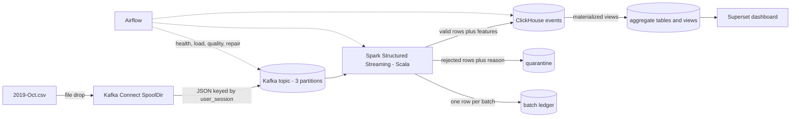
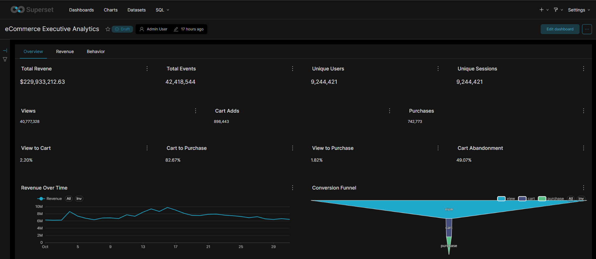
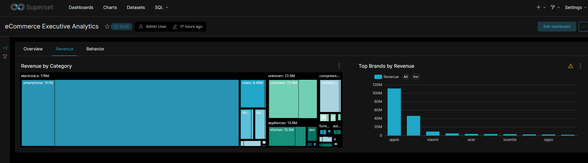
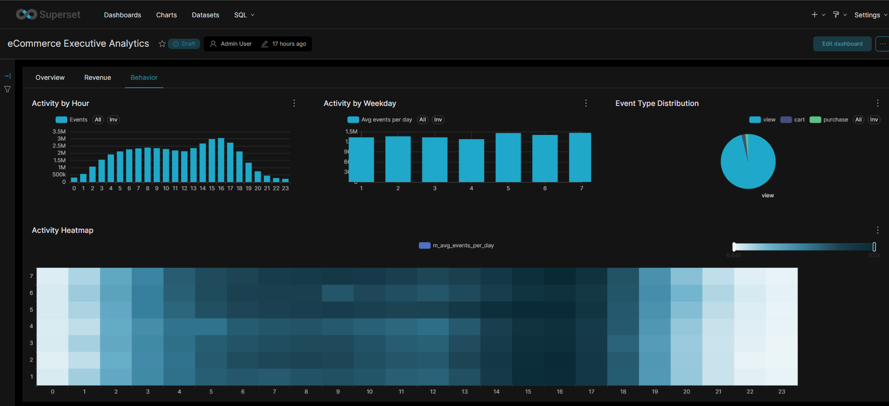

# eCommerce Real-Time Clickstream & Conversion Analytics Pipeline

An end-to-end, fully Dockerized Big Data pipeline. It replays the 42-million-row
[eCommerce behavior dataset](https://www.kaggle.com/datasets/mkechinov/ecommerce-behavior-data-from-multi-category-store)
(October 2019) as a stream, cleans and enriches it, stores it in a columnar OLAP database,
orchestrates quality checks, and serves an executive dashboard.



| Layer | Technology | Role |
|---|---|---|
| Ingestion | Kafka Connect + SpoolDir CSV connector | Streams a large CSV into Kafka without loading it into memory |
| Buffer | Apache Kafka 4.3 (KRaft, 3 partitions) | Durable, replayable, partitioned log |
| Processing | Spark 4.0 Structured Streaming (Scala 2.13) | Parse, validate, quarantine, enrich, load |
| Storage | ClickHouse 26.3 | Columnar OLAP + materialized-view aggregates |
| Orchestration | Apache Airflow 3.3 | Health, load, data-quality, repair, maintenance DAGs |
| BI | Apache Superset 6.0 | Executive dashboard over aggregate tables |
| Platform | Docker Compose, PostgreSQL 16 | Reproducible environment, metadata stores |

Authoritative versions: `.env.example`. Results and benchmarks: [docs/performance.md](docs/performance.md).

## Prerequisites

- Windows 10/11 with WSL2 and Docker Desktop (WSL2 engine). Scripts are PowerShell. The Docker parts are portable, but this project was built and tested on Windows only.
- 16 GB RAM (WSL limited to 10 GB for normal work, 12 GB for the full-scale run), about 40 GB free disk.
- Git. No Python, Java, Scala, or sbt installation is needed (everything builds in containers).

`%UserProfile%\.wslconfig`:

```ini
[wsl2]
memory=10GB
processors=6
swap=4GB
```

Then `wsl --shutdown` and restart Docker Desktop.

## Quick start A: no download (fixtures only, about 15 minutes)

```powershell
git clone [https://github.com/Lojaina-Ayman/ecommerce-big-data-pipeline.git](https://github.com/Lojaina-Ayman/ecommerce-big-data-pipeline.git)
cd ecommerce-big-data-pipeline
powershell -ExecutionPolicy Bypass -File scripts\bootstrap.ps1
powershell -ExecutionPolicy Bypass -File scripts\smoke-test.ps1
```

`bootstrap` generates `.env` (fresh secrets), builds the Spark jar and images, starts Kafka and ClickHouse,
creates the 3-partition topic, registers the connector, and creates Superset's read-only ClickHouse user.
`smoke-test` pushes 30 hand-checked messages through the whole pipeline and asserts 20+ numbers.
It must end with `SMOKE TEST PASSED`.

## Quick start B: the real dataset

1. Download `2019-Oct.csv` from Kaggle (free account) and place it at `data/raw/2019-Oct.csv` (about 5.3 GB, never committed).
2. Optional sample: `docker run --rm -v "${PWD}:/work" busybox sh /work/scripts/make_sample.sh` creates a 100k-row development sample.
3. Load: `scripts\load-csv.ps1 -Csv data\sample\events_sample_100k.csv`, then start the streaming job (below).
4. Full dataset: follow [docs/pipeline.md](docs/pipeline.md) section "Full run".

## Running the stack (Compose profiles keep RAM low)

| Need | Command |
|---|---|
| Core (Kafka, ClickHouse) | `docker compose up -d kafka clickhouse` |
| Ingest | `docker compose --profile ingest up -d kafka-connect kafka-ui` |
| Spark cluster | `docker compose --profile process up -d spark-master spark-worker` |
| Streaming job | `$env:SPARK_SINK="clickhouse"; docker compose --profile process --profile job up -d spark-job` |
| Airflow | `docker compose --profile orchestration up -d` |
| Superset | `docker compose --profile bi up -d` |
| Stop everything | `docker compose --profile "*"` stop (use `down`, never `down -v`, unless you want to delete all data) |

| Service | URL |
|---|---|
| Airflow | http://localhost:8080 |
| Spark master / job UI | http://localhost:8081 / http://localhost:4040 |
| Superset | http://localhost:8088 |
| Kafka UI | http://localhost:8090 |
| Kafka Connect REST | http://localhost:8083 |
| ClickHouse HTTP | http://localhost:8123 |

Credentials are generated into `.env` (not in Git).

## Documentation

| Topic | Document |
|---|---|
| Architecture, decisions, trade-offs | [docs/architecture.md](docs/architecture.md) |
| Runbook (start, stop, reset, full run) | [docs/pipeline.md](docs/pipeline.md) |
| Kafka and Connect | [docs/kafka.md](docs/kafka.md) |
| Spark job | [docs/spark.md](docs/spark.md) |
| ClickHouse schema | [docs/clickhouse.md](docs/clickhouse.md) |
| Airflow DAGs | [docs/airflow.md](docs/airflow.md) |
| Superset dashboard | [docs/superset.md](docs/superset.md) |
| Data dictionary and KPI definitions | [docs/data_dictionary.md](docs/data_dictionary.md) |
| Data quality | [docs/data_quality.md](docs/data_quality.md) |
| Testing | [docs/testing.md](docs/testing.md) |
| Performance | [docs/performance.md](docs/performance.md) |
| Troubleshooting | [docs/troubleshooting.md](docs/troubleshooting.md) |
| Viva guide | [docs/viva.md](docs/viva.md) |

## Dashboard





Import the committed export: Superset -> Dashboards -> Import -> `superset/exports/ecommerce_dashboard.zip`
(enter the `superset_ro` password from `.env` when asked; the export masks it).

## Repository layout

```text
docker-compose.yml  .env.example  scripts/        PowerShell tooling (bootstrap, smoke-test, ch, load, bench, ...)
kafka/{connect,config}   Connect image + connector config      spark/   Scala project (sbt in Docker)
clickhouse/{init,queries,migrations,experiments}   DDL, SQL    airflow/{dags,plugins,docker}   DAGs + shared library
superset/{docker,config,exports}   image, config, dashboard    postgres/init   metadata DB creation
tests/fixtures   golden-test data      bench/   benchmark results      docs/   documentation
```

## Known limitations (honest list)

Single node, replication factor 1, plain-text listeners, no TLS or SSO (development credentials in `.env`).
Streaming is a *replay* of historical data. Delivery is at-least-once with a ledger guard that closes most, not all,
of the duplicate window. Cart abandonment is session-level. See [docs/architecture.md](docs/architecture.md).

## License and data

Code: MIT License. The dataset belongs to its authors: see its Kaggle page for the terms.